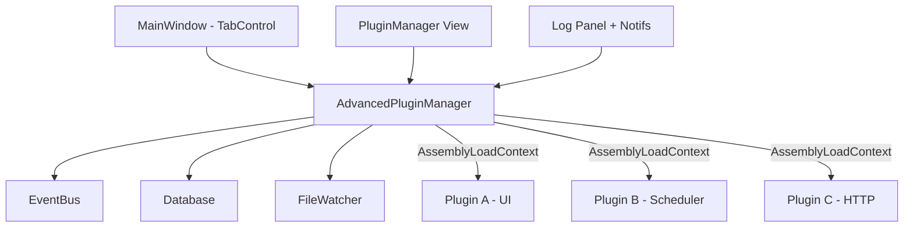
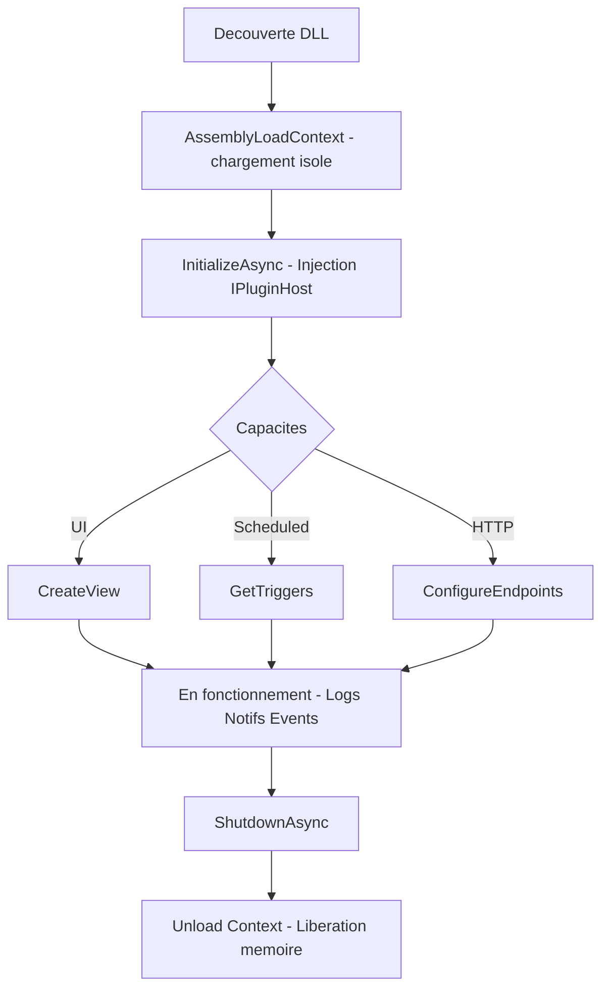

# 🔌 PluginFramework — Framework de Plugins Modulaire pour .NET 8

[](https://dotnet.microsoft.com/)
[](https://learn.microsoft.com/fr-fr/dotnet/desktop/wpf/)
[](https://www.quartz-scheduler.net/)
[](https://learn.microsoft.com/fr-fr/aspnet/core/)

Framework extensible de gestion de plugins pour applications .NET, supportant le **chargement/déchargement dynamique**, les **interfaces graphiques WPF**, les **tâches planifiées**, les **services HTTP**, la **persistance** et la **communication inter-plugins**.

---

## 📑 Table des matières

- [Architecture](#-architecture)
- [Prérequis](#-prérequis)
- [Structure de la solution](#-structure-de-la-solution)
- [Démarrage rapide](#-démarrage-rapide)
- [Créer un plugin](#-créer-un-plugin)
  - [Plugin UI](#plugin-ui)
  - [Plugin Scheduler](#plugin-scheduler)
  - [Plugin HTTP](#plugin-http)
  - [Plugin complet](#plugin-complet)
- [Capacités des plugins](#-capacités-des-plugins)
- [Communication avec le Host](#-communication-avec-le-host)
  - [Logs](#logs)
  - [Notifications](#notifications)
  - [EventBus](#eventbus)
- [Cycle de vie](#-cycle-de-vie)
- [Base de données](#-base-de-données)
- [Configuration](#-configuration)
- [API de référence](#-api-de-référence)
- [Bonnes pratiques](#-bonnes-pratiques)

---

## 🏛️ Architecture



**Principes clés** :
- **Isolation** : chaque plugin est chargé dans son propre `AssemblyLoadContext`
- **Hot-reload** : chargement/déchargement/rechargement sans redémarrage
- **Découverte automatique** : surveillance du dossier `Plugins/` via `FileSystemWatcher`
- **Multi-capacités** : un même plugin peut combiner UI + Scheduler + HTTP

---

## 📋 Prérequis

| Composant | Version |
|-----------|---------|
| .NET SDK | 8.0+ |
| Windows | 10/11 (WPF) |
| Visual Studio | 2022 17.8+ |

**Packages NuGet utilisés** :
- `Quartz` 3.x — Tâches planifiées
- `Dapper` — Accès base de données
- `Microsoft.Data.Sqlite` — SQLite embarqué
- `Microsoft.Extensions.Logging` — Logging
- `Microsoft.Extensions.Configuration` — Configuration
- `Microsoft.AspNetCore.App` — Endpoints HTTP

---

## 📁 Structure de la solution

| Projet | Rôle |
|--------|------|
| `PluginFramework.Contracts/` | Interfaces & modèles partagés (IPluginBase, IPluginHost, IUIPlugin, IScheduledPlugin, IHttpServicePlugin, IEventAggregator, IPluginDatabase, PluginAttribute…) |
| `PluginFramework.Core/` | Moteur du framework (AdvancedPluginManager, PluginLoadContext, PluginBridgeLogger, EventAggregator) |
| `DemoHost.Wpf/` | Application hôte WPF (App, MainWindow, PluginManagerView) |
| `Plugins/` | Plugins de démonstration (Demo.Ui, Demo.Scheduler, Demo.Http, Demo.Full) |

---

## 🚀 Démarrage rapide

### 1. Cloner et compiler

```bash
git clone <repo-url>
cd PluginFramework
dotnet build
```

### 2. Lancer le host

```bash
cd DemoHost.Wpf
dotnet run
```

Les plugins du dossier `Plugins/` sont automatiquement découverts et chargés au démarrage.

### 3. Interactions

| Action | Comment |
|--------|---------|
| Charger un plugin | Bouton **📂 Charger…** → sélectionner un `*.Plugin.dll` |
| Voir l'UI d'un plugin | Sélectionner le plugin → **🖼️ Afficher UI** |
| Recharger | Sélectionner → **🔄 Recharger** |
| Décharger | Sélectionner → **❌ Décharger** |
| Voir les logs | Panneau en bas de la vue Manager |

---

## 🔧 Créer un plugin

### Squelette minimal

1. Créer un projet `Class Library` ciblant `net8.0-windows`
2. Référencer `PluginFramework.Contracts` (sans copie locale)
3. Nommer l'assembly `*.Plugin.dll`

**.csproj** :

```xml
<Project Sdk="Microsoft.NET.Sdk">
  <PropertyGroup>
    <TargetFramework>net8.0-windows</TargetFramework>
    <UseWPF>true</UseWPF>
    <AssemblyName>MonPlugin.Plugin</AssemblyName>
  </PropertyGroup>
  <ItemGroup>
    <ProjectReference Include="..\..\PluginFramework.Contracts\PluginFramework.Contracts.csproj">
      <Private>false</Private>
      <ExcludeAssets>runtime</ExcludeAssets>
    </ProjectReference>
  </ItemGroup>
  <!-- Copie automatique vers le Host -->
  <Target Name="CopyToHostPlugins" AfterTargets="Build">
    <PropertyGroup>
      <PluginDestDir>..\..\DemoHost.Wpf\bin\$(Configuration)\net8.0-windows\Plugins\MonPlugin\</PluginDestDir>
    </PropertyGroup>
    <MakeDir Directories="$(PluginDestDir)" />
    <Copy SourceFiles="$(TargetPath)" DestinationFolder="$(PluginDestDir)" SkipUnchangedFiles="true" />
    <Copy SourceFiles="@(ReferenceCopyLocalPaths)" DestinationFolder="$(PluginDestDir)" SkipUnchangedFiles="true" />
  </Target>
</Project>
```

---

### Plugin UI

Expose une interface graphique WPF dans un onglet du host.

```csharp
using System.Windows;
using System.Windows.Controls;
using Microsoft.Extensions.Logging;
using PluginFramework.Contracts.Base;
using PluginFramework.Contracts.Plugins;
using PluginFramework.Contracts.Versioning;

namespace MonPlugin;

[Plugin(Id = "mon-plugin-ui", Name = "Mon Plugin UI", Version = "1.0.0")]
[InterfaceVersion(2, 0, 0)]
public class MonPluginUi : IUIPlugin
{
    private IPluginHost _host = null!;
    private ILogger _logger = null!;

    public string PluginId => "mon-plugin-ui";
    public string Name => "Mon Plugin UI";
    public string Version => "1.0.0";
    public Version InterfaceVersion => new(2, 0, 0);
    public PluginCapabilities Capabilities => PluginCapabilities.UI;

    public Task InitializeAsync(IPluginHost host)
    {
        _host = host;
        _logger = host.GetPluginLogger(PluginId);
        _logger.LogInformation("Plugin UI initialisé");
        return Task.CompletedTask;
    }

    public Task ShutdownAsync()
    {
        _logger.LogInformation("Plugin UI arrêté");
        return Task.CompletedTask;
    }

    public UIElement CreateView()
    {
        var panel = new StackPanel { Margin = new Thickness(16) };

        panel.Children.Add(new TextBlock
        {
            Text = "Hello depuis mon plugin !",
            FontSize = 20,
            FontWeight = FontWeights.Bold
        });

        var button = new Button { Content = "Cliquez-moi", Margin = new Thickness(0, 8, 0, 0) };
        button.Click += (_, _) =>
        {
            _logger.LogInformation("Bouton cliqué !");
            MessageBox.Show("Ça marche !");
        };
        panel.Children.Add(button);

        return panel;
    }
}
```

---

### Plugin Scheduler

Exécute des tâches planifiées via Quartz.NET sans interface graphique.

```csharp
using Microsoft.Extensions.Logging;
using Quartz;
using PluginFramework.Contracts.Base;
using PluginFramework.Contracts.Models;
using PluginFramework.Contracts.Plugins;
using PluginFramework.Contracts.Versioning;

namespace MonPlugin;

[Plugin(Id = "mon-scheduler", Name = "Mon Scheduler", Version = "1.0.0")]
[InterfaceVersion(2, 0, 0)]
public class MonSchedulerPlugin : IScheduledPlugin
{
    private IPluginHost _host = null!;
    private ILogger _logger = null!;

    public string PluginId => "mon-scheduler";
    public string Name => "Mon Scheduler";
    public string Version => "1.0.0";
    public Version InterfaceVersion => new(2, 0, 0);
    public PluginCapabilities Capabilities => PluginCapabilities.Scheduled;
    public bool ShouldRetryOnFailure => true;
    public int MaxRetries => 3;

    public Task InitializeAsync(IPluginHost host)
    {
        _host = host;
        _logger = host.GetPluginLogger(PluginId);
        return Task.CompletedTask;
    }

    public Task ShutdownAsync() => Task.CompletedTask;

    public async Task ExecuteAsync(IJobExecutionContext context)
    {
        _logger.LogInformation("Tâche exécutée à {Time}", DateTime.Now);

        _host.Notify(new PluginNotification
        {
            PluginId = PluginId,
            Title = "Tâche terminée",
            Message = "Exécution réussie",
            Level = NotificationLevel.Success
        });
    }

    public IReadOnlyList<ITrigger> GetTriggers() => new[]
    {
        TriggerBuilder.Create()
            .WithIdentity($"{PluginId}.trigger", "Plugins")
            .StartNow()
            .WithSimpleSchedule(s => s.WithIntervalInSeconds(30).RepeatForever())
            .Build()
    };
}
```

---

### Plugin HTTP

Expose des endpoints REST accessibles via le serveur HTTP intégré.

```csharp
using Microsoft.AspNetCore.Builder;
using Microsoft.AspNetCore.Http;
using Microsoft.Extensions.DependencyInjection;
using PluginFramework.Contracts.Base;
using PluginFramework.Contracts.Plugins;
using PluginFramework.Contracts.Versioning;

namespace MonPlugin;

[Plugin(Id = "mon-api", Name = "Mon API", Version = "1.0.0")]
[InterfaceVersion(2, 0, 0)]
public class MonApiPlugin : IHttpServicePlugin
{
    public string PluginId => "mon-api";
    public string Name => "Mon API";
    public string Version => "1.0.0";
    public Version InterfaceVersion => new(2, 0, 0);
    public PluginCapabilities Capabilities => PluginCapabilities.HttpService;
    public string RoutePrefix => "/api/mon-api";

    public Task InitializeAsync(IPluginHost host) => Task.CompletedTask;
    public Task ShutdownAsync() => Task.CompletedTask;

    public void ConfigureServices(IServiceCollection services) { }

    public void ConfigureEndpoints(WebApplication app)
    {
        app.MapGet("/api/mon-api/status", () =>
            Results.Ok(new { Status = "OK", Time = DateTime.Now }));

        app.MapPost("/api/mon-api/process", (HttpRequest request) =>
            Results.Ok(new { Result = "Traité" }));
    }
}
```

**Tester** :

```bash
curl http://localhost:5100/api/mon-api/status
```

---

### Plugin complet

Un plugin peut combiner **toutes les capacités** :

```csharp
public class MonPluginComplet : IUIPlugin, IScheduledPlugin, IHttpServicePlugin
{
    public PluginCapabilities Capabilities =>
        PluginCapabilities.UI |
        PluginCapabilities.Scheduled |
        PluginCapabilities.HttpService;

    // Implémenter toutes les interfaces...
}
```

---

## 🎯 Capacités des plugins

| Capacité | Interface | Description |
|----------|-----------|-------------|
| `UI` | `IUIPlugin` | Interface graphique WPF (onglet dans le host) |
| `Scheduled` | `IScheduledPlugin` | Tâches planifiées Quartz.NET |
| `HttpService` | `IHttpServicePlugin` | Endpoints REST ASP.NET Core |
| `Database` | via `IPluginHost` | Accès SQLite partagé |
| `Events` | via `IEventAggregator` | Communication inter-plugins |

Les capacités se combinent avec l'opérateur `|` :

```csharp
public PluginCapabilities Capabilities =>
    PluginCapabilities.UI | PluginCapabilities.Scheduled;
```

---

## 📡 Communication avec le Host

### Logs

Chaque plugin dispose d'un logger dédié dont les messages remontent automatiquement dans le panneau de logs du host.

```csharp
public Task InitializeAsync(IPluginHost host)
{
    var logger = host.GetPluginLogger(PluginId);

    logger.LogInformation("Plugin démarré");
    logger.LogWarning("Attention, ressource basse");
    logger.LogError("Erreur critique");

    return Task.CompletedTask;
}
```

**Filtrage dans le Host** :
- Par catégorie : Tous / Plugins seuls / Erreurs / Notifications
- Par plugin : filtre déroulant avec la liste des plugins chargés

---

### Notifications

Les plugins silencieux (sans UI) peuvent envoyer des notifications visibles sous forme de bannière dans le host.

```csharp
_host.Notify(new PluginNotification
{
    PluginId = PluginId,
    Title = "Import terminé",
    Message = "254 enregistrements importés avec succès",
    Level = NotificationLevel.Success,
    Data = { ["Count"] = 254 }
});
```

| Niveau | Couleur | Auto-dismiss |
|--------|---------|--------------|
| `Info` | Bleu clair | 10s |
| `Success` | Vert | 10s |
| `Warning` | Jaune | Manuel |
| `Error` | Rouge | Manuel |

---

### EventBus

Communication **entre plugins** ou **plugin ↔ host** via un bus d'événements typé.

**Publier un événement** :

```csharp
var eventBus = _host.GetService<IEventAggregator>();
eventBus?.Publish(new MonEvenement { Payload = "données" });
```

**S'abonner à un événement** :

```csharp
var eventBus = _host.GetService<IEventAggregator>();
var subscription = eventBus?.Subscribe<MonEvenement>(evt =>
{
    _logger.LogInformation("Reçu: {Payload}", evt.Payload);
});

// Se désabonner (dans ShutdownAsync)
subscription?.Dispose();
```

> ⚠️ **Toujours se désabonner** dans `ShutdownAsync()` pour éviter les fuites mémoire.

---

## 🔄 Cycle de vie



| Événement | Déclencheur |
|-----------|-------------|
| `PluginLoaded` | Chargement réussi |
| `PluginUnloaded` | Déchargement terminé |
| `PluginError` | Erreur durant le cycle de vie |

---

## 🗄️ Base de données

Le host fournit une base **SQLite partagée** accessible via `IPluginDatabase`.

```csharp
var db = _host.GetService<IPluginDatabase>()!;

// Créer une table (préfixer par le PluginId pour éviter les collisions)
await db.ExecuteAsync(@"
    CREATE TABLE IF NOT EXISTS MonPlugin_Data (
        Id INTEGER PRIMARY KEY AUTOINCREMENT,
        Key TEXT NOT NULL,
        Value TEXT,
        CreatedAt TEXT DEFAULT (datetime('now'))
    )");

// Insérer
await db.ExecuteAsync(
    "INSERT INTO MonPlugin_Data (Key, Value) VALUES (@Key, @Value)",
    new { Key = "config", Value = "valeur" });

// Lire
var items = await db.QueryAsync<MonModele>(
    "SELECT Key, Value FROM MonPlugin_Data WHERE Key = @Key",
    new { Key = "config" });

// Lire une valeur unique
var count = await db.QueryFirstOrDefaultAsync<int>(
    "SELECT COUNT(*) FROM MonPlugin_Data");
```

> 💡 **Convention** : préfixer les tables par `{PluginId}_` pour éviter les conflits entre plugins.

> ⚠️ Utiliser des **classes avec propriétés settables** (pas des `record` positionnels) pour le mapping Dapper avec SQLite.

```csharp
// ✅ Fonctionne
public class MonModele
{
    public string Key { get; set; } = "";
    public string Value { get; set; } = "";
}

// ❌ Ne fonctionne pas avec SQLite + Dapper
// public record MonModele(string Key, string Value);
```

---

## ⚙️ Configuration

### appsettings.json du Host

```json
{
  "PluginSettings": {
    "PluginPaths": [
      { "Path": "Plugins", "Recursive": true }
    ],
    "FilePattern": "*.Plugin.dll",
    "AutoLoadOnStartup": true,
    "WatchForChanges": true,
    "HttpPort": 5100,
    "DatabasePath": "plugins.db",
    "MaxRetryAttempts": 3,
    "RetryDelaySeconds": 5
  }
}
```

| Clé | Description | Défaut |
|-----|-------------|--------|
| `PluginPaths` | Dossiers de découverte (relatifs au binaire) | `Plugins/` |
| `FilePattern` | Pattern de recherche des DLLs | `*.Plugin.dll` |
| `AutoLoadOnStartup` | Charger automatiquement au démarrage | `true` |
| `WatchForChanges` | Surveiller les ajouts/modifications de fichiers | `true` |
| `HttpPort` | Port du serveur HTTP intégré | `5100` |
| `DatabasePath` | Chemin de la base SQLite | `plugins.db` |
| `MaxRetryAttempts` | Tentatives de retry pour les tâches planifiées | `3` |
| `RetryDelaySeconds` | Délai entre les tentatives | `5` |

### Accès à la configuration depuis un plugin

```csharp
public Task InitializeAsync(IPluginHost host)
{
    var config = host.GetService<IConfiguration>();
    var maValeur = config?["MaCle"] ?? "défaut";

    return Task.CompletedTask;
}
```

---

## 📖 API de référence

### IPluginHost

```csharp
public interface IPluginHost
{
    /// Logger générique du host
    ILogger Logger { get; }

    /// Conteneur de services partagés
    IServiceProvider Services { get; }

    /// Résoudre un service enregistré
    T? GetService<T>() where T : class;

    /// Enregistrer un service partagé entre plugins
    void RegisterService<T>(T service) where T : class;

    /// Logger dédié au plugin (logs visibles dans le Host)
    ILogger GetPluginLogger(string pluginId);

    /// Envoyer une notification au Host
    void Notify(PluginNotification notification);
}
```

### IPluginBase

```csharp
public interface IPluginBase
{
    string PluginId { get; }
    string Name { get; }
    string Version { get; }
    Version InterfaceVersion { get; }
    PluginCapabilities Capabilities { get; }

    Task InitializeAsync(IPluginHost host);
    Task ShutdownAsync();
}
```

### IUIPlugin

```csharp
public interface IUIPlugin : IPluginBase
{
    UIElement CreateView();
}
```

### IScheduledPlugin

```csharp
public interface IScheduledPlugin : IPluginBase, IJob
{
    bool ShouldRetryOnFailure { get; }
    int MaxRetries { get; }
    IReadOnlyList<ITrigger> GetTriggers();
    Task ExecuteAsync(IJobExecutionContext context);
}
```

### IHttpServicePlugin

```csharp
public interface IHttpServicePlugin : IPluginBase
{
    string RoutePrefix { get; }
    void ConfigureServices(IServiceCollection services);
    void ConfigureEndpoints(WebApplication app);
}
```

### IEventAggregator

```csharp
public interface IEventAggregator
{
    void Publish<T>(T eventData);
    IDisposable Subscribe<T>(Action<T> handler);
}
```

### IPluginDatabase

```csharp
public interface IPluginDatabase
{
    Task<int> ExecuteAsync(string sql, object? param = null);
    Task<IEnumerable<T>> QueryAsync<T>(string sql, object? param = null);
    Task<T?> QueryFirstOrDefaultAsync<T>(string sql, object? param = null);
}
```

---

## ✅ Bonnes pratiques

### Convention de nommage

| Élément | Convention | Exemple |
|---------|------------|---------|
| Assembly | `{Nom}.Plugin.dll` | `MonPlugin.Plugin.dll` |
| PluginId | `kebab-case` | `mon-super-plugin` |
| Tables SQL | `{PluginId}_NomTable` | `MonPlugin_Logs` |
| Routes HTTP | `/api/{plugin-id}/...` | `/api/mon-api/status` |

### Isolation et mémoire

- **Toujours** se désabonner de l'EventBus dans `ShutdownAsync()`
- **Ne pas** stocker de références statiques vers des objets du host
- **Préfixer** les tables SQL pour éviter les collisions
- **Utiliser** `host.GetPluginLogger()` au lieu de `host.Logger` pour que les logs remontent

### Gestion d'erreurs

```csharp
public async Task ExecuteAsync(IJobExecutionContext context)
{
    try
    {
        await FaireMonTraitement();
    }
    catch (Exception ex)
    {
        _logger.LogError(ex, "Erreur durant l'exécution planifiée");

        _host.Notify(new PluginNotification
        {
            PluginId = PluginId,
            Title = "Erreur d'exécution",
            Message = ex.Message,
            Level = NotificationLevel.Error
        });

        // Si ShouldRetryOnFailure = true, Quartz retentera automatiquement
        throw;
    }
}
```

### Hot-reload en développement

Le `FileSystemWatcher` détecte automatiquement les modifications de DLL dans le dossier `Plugins/`. Pour un workflow efficace :

1. Modifier le code du plugin
2. Recompiler avec `dotnet build`
3. La DLL est copiée dans `Plugins/` par le Target MSBuild
4. Le host détecte la modification et recharge automatiquement

> ⚠️ Sous Windows, le fichier peut être verrouillé. Le framework gère les retries automatiques.
